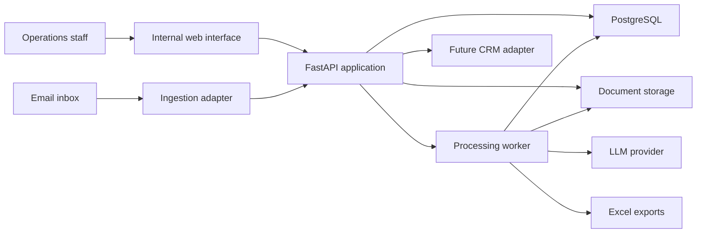
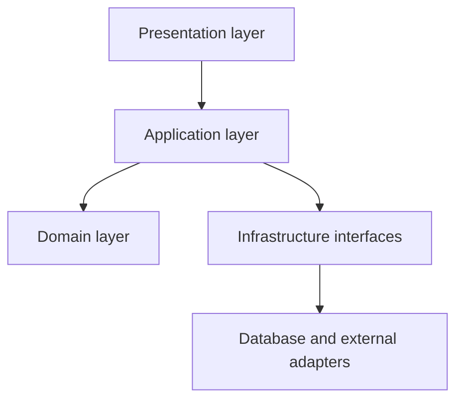
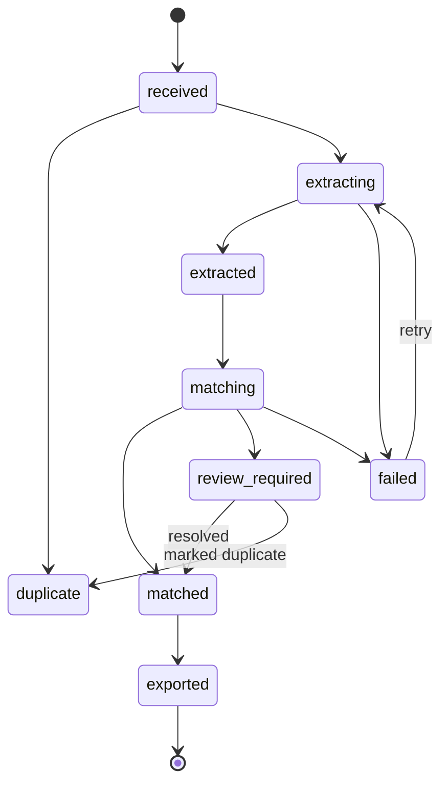
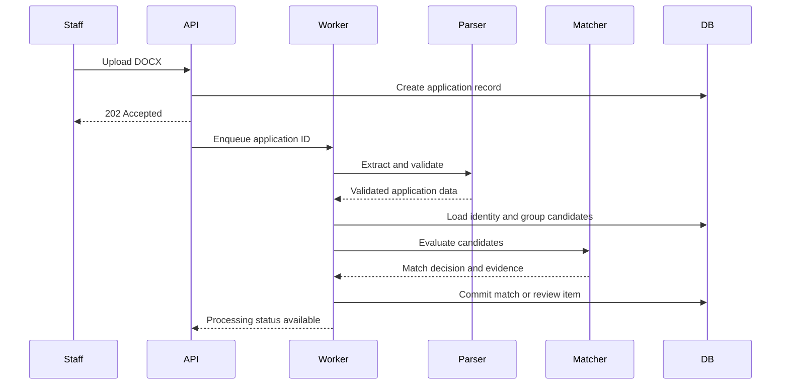

# Student Housing Application Processing System

## System Architecture

## 1. Purpose

This document defines the technical architecture for the Student Housing Application Processing System. It establishes the system boundaries, component responsibilities, API conventions, data contracts, domain models, service interfaces, transaction rules, error handling, and processing lifecycle.

The architecture is designed to support deterministic application processing first, followed by controlled LLM-assisted extraction and group matching. The database remains authoritative, all consequential decisions are auditable, and ambiguous cases remain under human control.

This document describes how the system is organized. Detailed database columns, matching weights, extraction prompts, Excel formatting rules, security controls, and test cases will be specified in their respective documents.

## 2. Architectural Goals

The architecture must provide:

- Clear separation between transport, business logic, persistence, and external integrations.
- Stable typed contracts between components.
- Deterministic control over database writes and group numbering.
- Idempotent application ingestion and processing.
- Replaceable LLM, storage, and export implementations.
- Traceable automated and manual decisions.
- Safe recovery from partial failures.
- Testable business logic without requiring a live API, database, or LLM.
- A path from a single-machine MVP to a multi-user production deployment.

## 3. Architectural Principles

### 3.1 Database as the source of truth

PostgreSQL stores canonical applicants, groups, memberships, decisions, reviews, and processing state. DOCX files are immutable source artifacts. Excel files are generated projections.

### 3.2 Domain logic is framework-independent

Matching rules, state transitions, validation decisions, and group operations must not depend directly on FastAPI, SQLAlchemy, Streamlit, `openpyxl`, or a specific LLM SDK.

### 3.3 LLMs propose; application services decide

An LLM may return structured extraction candidates. It cannot allocate group numbers, merge applicants, approve a group match, or write directly to persistence.

### 3.4 Strong identifiers outrank fuzzy evidence

Normalized email and phone matches outrank name similarity. Fuzzy comparisons support decisions but do not independently establish identity.

### 3.5 Ambiguity is a valid system outcome

The processing pipeline is not required to force every application into a group. `REVIEW_REQUIRED` is an expected result, not an exception.

### 3.6 All consequential mutations are auditable

Group creation, membership changes, contact changes, field corrections, match approvals, and exports produce immutable audit events.

### 3.7 External systems are behind adapters

LLM providers, object storage, email ingestion, Barefoot CRM, and filesystem operations are accessed through interfaces so implementations can change without rewriting domain logic.

## 4. System Context



### External actors and systems

- **Operations staff:** Upload applications, inspect groups, resolve review items, correct data, and generate exports.
- **Email inbox:** Future source of application attachments.
- **LLM provider:** Optional structured extraction service.
- **Document storage:** Stores original DOCX files and generated exports.
- **Barefoot CRM:** Future synchronization target.

## 5. Runtime Architecture

### 5.1 MVP runtime

The initial version may run as a single Python deployment containing:

- FastAPI HTTP server
- Streamlit internal interface
- SQLite database
- Local document storage
- In-process or command-triggered processing

### 5.2 Production runtime

The production design separates responsibilities into:

- FastAPI web/API process
- PostgreSQL database
- Background worker process
- Durable job queue
- Private object storage
- Internal review interface
- Scheduled export and backup jobs

Recommended production queue options are Redis with Dramatiq or Redis with RQ. Celery is acceptable if operational requirements justify its additional complexity.

### 5.3 Deployment model

The application begins as a modular monolith. All modules deploy together, but boundaries are designed as if they were separate services. This avoids premature distributed-system complexity while preserving the ability to separate high-volume workloads later.

## 6. Layered Architecture



### 6.1 Presentation layer

Contains FastAPI routes, request parsing, authentication integration, response serialization, and Streamlit views.

The presentation layer may:

- Validate transport-level input.
- Call application use cases.
- Translate domain results into HTTP responses.
- Supply authenticated actor information.

It may not:

- Execute matching rules.
- Allocate group numbers.
- Write directly through SQLAlchemy sessions.
- Invoke an LLM directly.
- Format Excel workbooks.

### 6.2 Application layer

Coordinates use cases and transaction boundaries. Application services load domain state through repositories, invoke domain policies, persist changes, publish internal events, and return typed results.

Examples:

- Ingest an application
- Process an application
- Resolve a review item
- Correct extracted data
- Change a group contact
- Generate an Excel export

### 6.3 Domain layer

Contains entities, value objects, enums, domain services, policies, decisions, and domain errors.

The domain layer has no dependency on FastAPI, SQLAlchemy, Pydantic, Streamlit, or provider SDKs.

### 6.4 Infrastructure layer

Implements repositories and adapters for:

- PostgreSQL or SQLite
- DOCX extraction
- LLM structured output
- File and object storage
- Excel generation
- Background jobs
- Email and CRM integrations

## 7. Proposed Repository Structure

```text
student-housing-processor/
├── pyproject.toml
├── alembic.ini
├── README.md
├── docs/
│   ├── PROJECT_OVERVIEW.md
│   ├── SYSTEM_ARCHITECTURE.md
│   └── ...
├── src/
│   └── housing_processor/
│       ├── main.py
│       ├── bootstrap.py
│       ├── config.py
│       ├── presentation/
│       │   ├── api/
│       │   │   ├── dependencies.py
│       │   │   ├── errors.py
│       │   │   ├── routes/
│       │   │   │   ├── applications.py
│       │   │   │   ├── applicants.py
│       │   │   │   ├── groups.py
│       │   │   │   ├── reviews.py
│       │   │   │   └── exports.py
│       │   │   └── contracts/
│       │   │       ├── common.py
│       │   │       ├── applications.py
│       │   │       ├── groups.py
│       │   │       ├── reviews.py
│       │   │       └── exports.py
│       │   └── dashboard/
│       ├── application/
│       │   ├── commands/
│       │   ├── queries/
│       │   ├── handlers/
│       │   ├── dto/
│       │   └── services/
│       ├── domain/
│       │   ├── applications/
│       │   ├── applicants/
│       │   ├── groups/
│       │   ├── matching/
│       │   ├── reviews/
│       │   ├── properties/
│       │   ├── audit/
│       │   └── shared/
│       ├── infrastructure/
│       │   ├── database/
│       │   │   ├── models/
│       │   │   ├── repositories/
│       │   │   ├── migrations/
│       │   │   └── unit_of_work.py
│       │   ├── docx/
│       │   ├── llm/
│       │   ├── storage/
│       │   ├── excel/
│       │   ├── jobs/
│       │   └── integrations/
│       └── observability/
├── tests/
│   ├── unit/
│   ├── integration/
│   ├── contract/
│   ├── end_to_end/
│   └── fixtures/
└── scripts/
```

## 8. Type Strategy

The project uses different type categories for different boundaries.

| Type | Technology | Purpose |
| --- | --- | --- |
| API contracts | Pydantic models | Validate and serialize HTTP input/output |
| Application DTOs | Frozen dataclasses or Pydantic | Pass data between use-case boundaries |
| Domain entities | Dataclasses | Represent stateful business objects |
| Value objects | Frozen dataclasses | Represent validated domain concepts |
| Persistence models | SQLAlchemy models | Map database tables |
| External provider contracts | Pydantic models | Validate LLM and integration responses |

API models, domain entities, and SQLAlchemy models must remain separate. Sharing one model across all three layers creates accidental coupling and unsafe persistence behavior.

## 9. Domain Types

### 9.1 Identifiers

Use UUIDs for internal entity identifiers and integer group numbers for staff-facing ordering.

```python
from typing import NewType
from uuid import UUID

ApplicationId = NewType("ApplicationId", UUID)
ApplicantId = NewType("ApplicantId", UUID)
GroupId = NewType("GroupId", UUID)
ReviewItemId = NewType("ReviewItemId", UUID)
PropertyId = NewType("PropertyId", UUID)
```

### 9.2 Core enums

```python
from enum import StrEnum

class ApplicationStatus(StrEnum):
    RECEIVED = "received"
    EXTRACTING = "extracting"
    EXTRACTED = "extracted"
    MATCHING = "matching"
    REVIEW_REQUIRED = "review_required"
    MATCHED = "matched"
    EXPORTED = "exported"
    FAILED = "failed"
    DUPLICATE = "duplicate"

class GroupStatus(StrEnum):
    INCOMPLETE = "incomplete"
    ACTIVE = "active"
    COMPLETE = "complete"
    REVIEW_REQUIRED = "review_required"
    ARCHIVED = "archived"

class MatchDecisionType(StrEnum):
    ATTACH_TO_EXISTING = "attach_to_existing"
    CREATE_NEW_GROUP = "create_new_group"
    REVIEW_REQUIRED = "review_required"

class MatchMethod(StrEnum):
    EXACT_EMAIL = "exact_email"
    EXACT_PHONE = "exact_phone"
    ROOMMATE_REFERENCE = "roommate_reference"
    ROOMMATE_OVERLAP = "roommate_overlap"
    MANUAL = "manual"

class ReviewStatus(StrEnum):
    OPEN = "open"
    RESOLVED = "resolved"
    DISMISSED = "dismissed"
```

### 9.3 Value objects

Value objects validate themselves at construction and are immutable.

```python
from dataclasses import dataclass

@dataclass(frozen=True, slots=True)
class EmailAddress:
    original: str
    normalized: str

@dataclass(frozen=True, slots=True)
class PhoneNumber:
    original: str
    e164: str

@dataclass(frozen=True, slots=True)
class PersonName:
    first: str
    last: str
    normalized: str

@dataclass(frozen=True, slots=True)
class ConfidenceScore:
    value: float

    def __post_init__(self) -> None:
        if not 0.0 <= self.value <= 1.0:
            raise ValueError("Confidence must be between 0 and 1")
```

### 9.4 Domain entities

Domain entities contain business behavior but no persistence code.

```python
from dataclasses import dataclass, field
from datetime import datetime
from decimal import Decimal

@dataclass(slots=True)
class Applicant:
    id: ApplicantId
    name: PersonName
    email: EmailAddress | None
    phone: PhoneNumber | None
    gpa: Decimal | None
    created_at: datetime

@dataclass(slots=True)
class GroupMember:
    applicant_id: ApplicantId
    is_contact: bool
    match_method: MatchMethod
    match_confidence: ConfidenceScore
    source_application_id: ApplicationId
    joined_at: datetime

@dataclass(slots=True)
class HousingGroup:
    id: GroupId
    group_number: int
    status: GroupStatus
    first_application_received_at: datetime
    members: list[GroupMember] = field(default_factory=list)

    def add_member(self, member: GroupMember) -> None:
        if any(existing.applicant_id == member.applicant_id for existing in self.members):
            raise DuplicateGroupMemberError(member.applicant_id)
        self.members.append(member)

    def set_contact(self, applicant_id: ApplicantId) -> None:
        if not any(member.applicant_id == applicant_id for member in self.members):
            raise ContactMustBeGroupMemberError(applicant_id)
        for member in self.members:
            member.is_contact = member.applicant_id == applicant_id
```

Domain entity examples are illustrative. Exact fields will follow the database and domain design documents.

## 10. API Conventions

### 10.1 Base path and versioning

All HTTP endpoints use:

```text
/api/v1
```

Breaking contract changes require a new API version. Additive response fields do not require a new version.

### 10.2 Serialization

- JSON field names use `snake_case`.
- Timestamps use ISO 8601 UTC with a `Z` suffix.
- UUIDs are serialized as strings.
- Money is not currently part of the domain.
- GPA values are serialized as decimal strings or numbers according to the final contract decision; they must not be stored as binary floating-point values.
- Missing optional values are `null`.
- Empty collections are `[]`.

### 10.3 Standard response metadata

List responses use a shared envelope:

```python
from pydantic import BaseModel, Field

class PageMeta(BaseModel):
    limit: int
    offset: int
    total: int

class PaginatedResponse[T](BaseModel):
    items: list[T]
    page: PageMeta
```

Single-resource responses return the resource directly unless shared metadata is required.

### 10.4 Error contract

```python
class ErrorDetail(BaseModel):
    code: str
    message: str
    field: str | None = None
    context: dict[str, object] = Field(default_factory=dict)

class ErrorResponse(BaseModel):
    request_id: str
    errors: list[ErrorDetail]
```

Error codes are stable machine-readable identifiers. Human-readable messages may improve over time.

Example:

```json
{
  "request_id": "01J...",
  "errors": [
    {
      "code": "group.contact_not_member",
      "message": "The selected contact person is not a member of this group.",
      "field": "contact_applicant_id",
      "context": {"group_number": 14}
    }
  ]
}
```

### 10.5 Idempotency

Mutation endpoints that may be retried accept an optional `Idempotency-Key` header. Uploads are additionally protected by file hashes.

The system stores:

- Idempotency key
- Authenticated actor
- Request fingerprint
- Result status
- Created resource identifier
- Expiration timestamp

Reusing a key with a different request body returns `409 Conflict`.

### 10.6 Optimistic concurrency

Mutable resources expose a `version` integer. Update commands include `expected_version`. If the stored version has changed, the API returns `409 Conflict` rather than overwriting another employee's work.

## 11. API Surface

### 11.1 Applications

#### Upload an application

```text
POST /api/v1/applications
Content-Type: multipart/form-data
```

Input:

- `file`: DOCX file
- `received_at`: optional ISO 8601 timestamp
- `source`: manual upload, email, import, or API

Response: `202 Accepted`

```python
class ApplicationAcceptedResponse(BaseModel):
    application_id: UUID
    status: ApplicationStatus
    duplicate_of_application_id: UUID | None
    received_at: datetime
```

#### List applications

```text
GET /api/v1/applications
```

Filters:

- `status`
- `received_from`
- `received_to`
- `group_id`
- `review_required`
- `limit`
- `offset`

#### Get application details

```text
GET /api/v1/applications/{application_id}
```

Returns source metadata, processing status, extracted fields, warnings, group decision, and audit summary. Raw document content should require an elevated permission.

#### Reprocess an application

```text
POST /api/v1/applications/{application_id}/reprocess
```

```python
class ReprocessApplicationRequest(BaseModel):
    expected_version: int
    extraction_mode: str = "current"
    preserve_confirmed_decisions: bool = True
    reason: str
```

Reprocessing must not destroy confirmed manual corrections or group membership unless explicitly authorized by a separate correction workflow.

#### Correct extracted data

```text
PATCH /api/v1/applications/{application_id}/extracted-data
```

Corrections are represented as explicit field changes and produce audit events.

### 11.2 Applicants

```text
GET   /api/v1/applicants
GET   /api/v1/applicants/{applicant_id}
PATCH /api/v1/applicants/{applicant_id}
POST  /api/v1/applicants/{applicant_id}/merge
```

Applicant merges are privileged operations. A merge requires an expected version, a reason, supporting evidence, and a designated surviving applicant record.

### 11.3 Groups

```text
GET    /api/v1/groups
POST   /api/v1/groups
GET    /api/v1/groups/{group_id}
PATCH  /api/v1/groups/{group_id}
POST   /api/v1/groups/{group_id}/members
DELETE /api/v1/groups/{group_id}/members/{applicant_id}
PUT    /api/v1/groups/{group_id}/contact
POST   /api/v1/groups/{group_id}/merge
```

Manual group creation is permitted only through an authenticated command and allocates the next permanent group number within the database transaction.

Example membership command:

```python
class AddGroupMemberRequest(BaseModel):
    applicant_id: UUID
    source_application_id: UUID | None = None
    expected_group_version: int
    reason: str
```

Example contact command:

```python
class SetGroupContactRequest(BaseModel):
    contact_applicant_id: UUID
    expected_group_version: int
    reason: str
```

### 11.4 Review items

```text
GET  /api/v1/reviews
GET  /api/v1/reviews/{review_item_id}
POST /api/v1/reviews/{review_item_id}/resolve
POST /api/v1/reviews/{review_item_id}/dismiss
```

Review resolution is modeled as a discriminated union:

```python
from typing import Annotated, Literal, Union
from pydantic import BaseModel, Field

class AttachToGroupResolution(BaseModel):
    action: Literal["attach_to_group"]
    group_id: UUID

class CreateGroupResolution(BaseModel):
    action: Literal["create_group"]

class MarkDuplicateResolution(BaseModel):
    action: Literal["mark_duplicate"]
    duplicate_of_application_id: UUID

class RejectApplicationResolution(BaseModel):
    action: Literal["reject_application"]
    reason_code: str

ReviewResolution = Annotated[
    Union[
        AttachToGroupResolution,
        CreateGroupResolution,
        MarkDuplicateResolution,
        RejectApplicationResolution,
    ],
    Field(discriminator="action"),
]

class ResolveReviewRequest(BaseModel):
    resolution: ReviewResolution
    corrections: list[FieldCorrection] = Field(default_factory=list)
    expected_review_version: int
    notes: str | None = None
```

### 11.5 Exports

```text
POST /api/v1/exports/excel
GET  /api/v1/exports
GET  /api/v1/exports/{export_id}
GET  /api/v1/exports/{export_id}/download
```

```python
class CreateExcelExportRequest(BaseModel):
    include_group_statuses: list[GroupStatus] = [
        GroupStatus.INCOMPLETE,
        GroupStatus.ACTIVE,
        GroupStatus.COMPLETE,
        GroupStatus.REVIEW_REQUIRED,
    ]
    as_of: datetime | None = None
```

Export creation returns `202 Accepted` when executed in the background.

### 11.6 Health and operations

```text
GET /health/live
GET /health/ready
GET /api/v1/system/version
```

Readiness checks verify database connectivity and required storage availability. They should not invoke the LLM provider on every request.

## 12. Extraction Contracts

### 12.1 Raw document contract

DOCX extraction produces a provider-neutral structure.

```python
class TextRun(BaseModel):
    text: str
    bold: bool = False
    italic: bool = False

class DocumentParagraph(BaseModel):
    index: int
    text: str
    runs: list[TextRun]

class DocumentTable(BaseModel):
    index: int
    rows: list[list[str]]

class RawDocumentContent(BaseModel):
    paragraphs: list[DocumentParagraph]
    tables: list[DocumentTable]
    combined_text: str
    extraction_warnings: list[str] = Field(default_factory=list)
```

### 12.2 Extracted application contract

All extracted values retain provenance and confidence.

```python
class ExtractedValue[T](BaseModel):
    value: T | None
    raw_value: str | None
    source: str
    confidence: float
    warnings: list[str] = Field(default_factory=list)

class PersonReferenceContract(BaseModel):
    full_name: ExtractedValue[str]
    email: ExtractedValue[str] | None = None
    phone: ExtractedValue[str] | None = None

class HousePreferenceContract(BaseModel):
    raw_property: str
    normalized_property_id: UUID | None
    rank: int | None
    confidence: float

class ExtractedApplicationContract(BaseModel):
    schema_version: str
    applicant: PersonReferenceContract
    gpa: ExtractedValue[str] | None
    contact_person: PersonReferenceContract | None
    roommates: list[PersonReferenceContract]
    requested_houses: list[HousePreferenceContract]
    expected_group_size: ExtractedValue[int] | None
    application_date: ExtractedValue[date] | None
    warnings: list[str]
```

`source` values should identify locations such as `table:1:row:4`, `paragraph:12`, `deterministic_parser`, or `llm`. The final extraction pipeline may add richer source spans.

### 12.3 Validation result

```python
@dataclass(frozen=True, slots=True)
class ValidationIssue:
    code: str
    field_path: str
    severity: str
    message: str

@dataclass(frozen=True, slots=True)
class ValidatedApplicationData:
    applicant: ApplicantCandidate
    roommates: tuple[PersonReference, ...]
    contact_person: PersonReference | None
    house_preferences: tuple[HousePreference, ...]
    expected_group_size: int | None
    application_date: date | None
    issues: tuple[ValidationIssue, ...]
```

Validation warnings may continue to matching. Blocking issues create review items or processing failures depending on whether human correction is possible.

## 13. Matching Contracts

Matching results must expose evidence, not only a score.

```python
@dataclass(frozen=True, slots=True)
class MatchEvidence:
    code: str
    description: str
    weight: int
    source_application_id: ApplicationId | None = None
    related_applicant_id: ApplicantId | None = None

@dataclass(frozen=True, slots=True)
class GroupCandidate:
    group_id: GroupId
    group_number: int
    score: int
    evidence: tuple[MatchEvidence, ...]
    hard_conflicts: tuple[MatchEvidence, ...]

@dataclass(frozen=True, slots=True)
class GroupMatchDecision:
    decision: MatchDecisionType
    selected_group_id: GroupId | None
    confidence: ConfidenceScore
    candidates: tuple[GroupCandidate, ...]
    reason_codes: tuple[str, ...]
    matcher_version: str
```

Every automated match stores the matching policy version and the evidence used at the time of decision.

## 14. Application Commands and Results

Commands represent requested state changes. They are immutable and contain actor context.

```python
@dataclass(frozen=True, slots=True)
class ActorContext:
    actor_id: UUID
    role: str
    request_id: str

@dataclass(frozen=True, slots=True)
class ProcessApplicationCommand:
    application_id: ApplicationId
    actor: ActorContext
    force_reprocess: bool = False

@dataclass(frozen=True, slots=True)
class ProcessApplicationResult:
    application_id: ApplicationId
    status: ApplicationStatus
    applicant_id: ApplicantId | None
    group_id: GroupId | None
    group_number: int | None
    review_item_id: ReviewItemId | None
    warnings: tuple[str, ...]
```

Queries return read-optimized DTOs and do not expose mutable domain entities.

## 15. Service Interfaces

Interfaces are expressed as Python protocols so application and domain logic can be tested with in-memory implementations.

### 15.1 Document reader

```python
from pathlib import Path
from typing import Protocol

class DocumentReader(Protocol):
    def read(self, path: Path) -> RawDocumentContent: ...
```

### 15.2 Structured extractor

```python
class StructuredApplicationExtractor(Protocol):
    def extract(
        self,
        document: RawDocumentContent,
        deterministic_result: ExtractedApplicationContract,
    ) -> ExtractedApplicationContract: ...
```

The deterministic-only implementation returns the supplied parse result. The LLM implementation fills or clarifies fields while preserving provenance.

### 15.3 Identity resolver

```python
class ApplicantIdentityResolver(Protocol):
    def resolve(
        self,
        candidate: ApplicantCandidate,
    ) -> ApplicantResolution: ...
```

The resolver returns candidates and evidence. The application service controls whether the result is persisted automatically or reviewed.

### 15.4 Group matcher

```python
class GroupMatcher(Protocol):
    def match(
        self,
        application: ValidatedApplicationData,
        applicant: ApplicantResolution,
        candidate_groups: tuple[HousingGroup, ...],
    ) -> GroupMatchDecision: ...
```

### 15.5 Storage

```python
class FileStorage(Protocol):
    def save_source(self, content: bytes, filename: str) -> StoredFile: ...
    def save_export(self, content: bytes, filename: str) -> StoredFile: ...
    def open(self, storage_key: str) -> BinaryIO: ...
```

### 15.6 Excel renderer

```python
class ExcelRenderer(Protocol):
    def render(self, projection: HousingWorkbookProjection) -> bytes: ...
```

### 15.7 Clock and identifiers

```python
class Clock(Protocol):
    def now(self) -> datetime: ...

class IdGenerator(Protocol):
    def new_uuid(self) -> UUID: ...
```

Injecting clocks and identifiers keeps tests deterministic.

## 16. Repository Interfaces

Repositories operate on domain entities or application DTOs, not API request models.

```python
class ApplicationRepository(Protocol):
    def get(self, application_id: ApplicationId) -> ApplicationRecord: ...
    def find_by_file_hash(self, file_hash: str) -> ApplicationRecord | None: ...
    def add(self, application: ApplicationRecord) -> None: ...
    def save(self, application: ApplicationRecord) -> None: ...

class ApplicantRepository(Protocol):
    def get(self, applicant_id: ApplicantId) -> Applicant: ...
    def find_by_email(self, normalized_email: str) -> tuple[Applicant, ...]: ...
    def find_by_phone(self, e164_phone: str) -> tuple[Applicant, ...]: ...
    def search_by_name(self, normalized_name: str) -> tuple[Applicant, ...]: ...
    def add(self, applicant: Applicant) -> None: ...
    def save(self, applicant: Applicant) -> None: ...

class GroupRepository(Protocol):
    def get(self, group_id: GroupId, *, for_update: bool = False) -> HousingGroup: ...
    def find_candidates(self, query: GroupCandidateQuery) -> tuple[HousingGroup, ...]: ...
    def add(self, group: HousingGroup) -> None: ...
    def save(self, group: HousingGroup) -> None: ...

class ReviewRepository(Protocol):
    def get(self, review_id: ReviewItemId, *, for_update: bool = False) -> ReviewItem: ...
    def add(self, review: ReviewItem) -> None: ...
    def save(self, review: ReviewItem) -> None: ...
```

Repository implementations must avoid hidden commits. The unit of work owns transaction completion.

## 17. Unit of Work and Transactions

```python
class UnitOfWork(Protocol):
    applications: ApplicationRepository
    applicants: ApplicantRepository
    groups: GroupRepository
    reviews: ReviewRepository
    audits: AuditRepository

    def __enter__(self) -> "UnitOfWork": ...
    def __exit__(self, exc_type, exc, traceback) -> None: ...
    def commit(self) -> None: ...
    def rollback(self) -> None: ...
```

The following operations must be atomic:

- Creating a group and allocating its number
- Creating or resolving an applicant identity
- Adding a group membership
- Updating pending roommate references
- Creating or resolving a review item
- Recording related audit events
- Advancing the application status

Document uploads occur before the database transaction. If database ingestion fails, the stored file is retained temporarily and cleaned up by a reconciliation job.

Excel generation occurs after the authoritative transaction commits. Export failure does not roll back correct application data; it creates a failed export record that can be retried.

## 18. Processing State Machine



### State transition rules

- Only received applications may begin initial extraction.
- Duplicate detection may terminate processing before extraction.
- A failed application may be retried after the failure is classified as retryable or corrected.
- A review item must be resolved before its application becomes matched.
- `EXPORTED` means the application was included in at least one successful export; it does not prevent future corrected exports.
- Manual corrections do not bypass validation.

Status transitions are enforced in the domain or application layer, not only in the UI.

## 19. End-to-End Processing Sequence



## 20. Processing Orchestrator

```python
class ProcessApplicationHandler:
    def __init__(
        self,
        uow_factory: UnitOfWorkFactory,
        document_reader: DocumentReader,
        deterministic_parser: DeterministicParser,
        structured_extractor: StructuredApplicationExtractor,
        validator: ApplicationValidator,
        identity_resolver: ApplicantIdentityResolver,
        group_matcher: GroupMatcher,
        storage: FileStorage,
        clock: Clock,
    ) -> None:
        ...

    def handle(self, command: ProcessApplicationCommand) -> ProcessApplicationResult:
        # 1. Load the application and verify its current state.
        # 2. Read the immutable source document.
        # 3. Run deterministic extraction.
        # 4. Optionally run structured LLM extraction.
        # 5. Validate and normalize the extracted contract.
        # 6. Load identity and group candidates.
        # 7. Produce an evidence-backed decision.
        # 8. Commit a group attachment, new group, or review item.
        # 9. Record audit events and return a typed result.
        ...
```

The handler coordinates collaborators but does not contain parsing rules, scoring weights, SQL queries, or workbook formatting logic.

## 21. Group Number Allocation

Production PostgreSQL uses a database sequence or equivalent atomic allocator.

```sql
CREATE SEQUENCE group_number_seq START WITH 1 INCREMENT BY 1;
```

Group creation obtains `nextval('group_number_seq')` inside the group-creation transaction. Gaps are acceptable if a transaction rolls back; uniqueness and permanence are more important than gap-free numbering.

The SQLite MVP uses a database-controlled autoincrement allocation or a single-writer transaction. Application code must never calculate `MAX(group_number) + 1` in production.

## 22. Internal Events

Domain or application events decouple follow-up work from authoritative mutations.

Initial events include:

- `ApplicationReceived`
- `ApplicationExtractionCompleted`
- `ApplicationProcessingFailed`
- `ApplicantCreated`
- `ApplicantMatched`
- `GroupCreated`
- `ApplicantAddedToGroup`
- `GroupContactChanged`
- `ReviewItemCreated`
- `ReviewItemResolved`
- `ExcelExportRequested`
- `ExcelExportCompleted`
- `ExcelExportFailed`

Events are recorded in the same transaction as the associated state change using an outbox table. A worker publishes or handles committed outbox events. This prevents database state from committing while a required background message is lost.

The MVP may process outbox events synchronously, but it should preserve the outbox contract.

## 23. Background Job Contracts

Queue messages contain identifiers, not full student records.

```python
class ProcessApplicationJob(BaseModel):
    schema_version: str = "1.0"
    application_id: UUID
    requested_by: UUID
    request_id: str
    attempt: int = 1

class GenerateExcelExportJob(BaseModel):
    schema_version: str = "1.0"
    export_id: UUID
    requested_by: UUID
    request_id: str
```

Workers reload current data from the database. This prevents stale or sensitive payloads from accumulating in the queue.

## 24. Retry and Failure Policy

Failures are classified as:

- **Validation:** Input is understandable but requires correction.
- **Domain conflict:** Requested action violates business rules.
- **Not found:** Referenced resource does not exist or is inaccessible.
- **Concurrency:** Stored version differs from the expected version.
- **Transient infrastructure:** Database connection, storage timeout, queue interruption, or provider outage.
- **Permanent infrastructure:** Unsupported DOCX, corrupted file, invalid configuration, or unavailable required dependency.
- **External provider:** LLM or CRM error.

Only transient failures are retried automatically. Recommended retry behavior:

- Exponential backoff with jitter
- Maximum attempt count
- No retry for validation or domain errors
- Dead-letter or failed-job record after exhaustion
- Manual retry endpoint with an audit reason

LLM failure should fall back to deterministic extraction when possible. It must not leave an application in an uncertain partially written state.

## 25. Domain Errors and HTTP Mapping

| Domain error | HTTP status | Error code |
| --- | ---: | --- |
| Resource not found | 404 | `resource.not_found` |
| Duplicate upload | 409 or accepted duplicate result | `application.duplicate_file` |
| Invalid state transition | 409 | `application.invalid_status_transition` |
| Version conflict | 409 | `resource.version_conflict` |
| Duplicate group member | 409 | `group.duplicate_member` |
| Contact not in group | 422 | `group.contact_not_member` |
| Ambiguous identity | 202/review result | `applicant.review_required` |
| Invalid request field | 422 | `request.validation_failed` |
| Unsupported document | 415 | `application.unsupported_document` |
| Authorization failure | 403 | `authorization.denied` |
| Unexpected internal failure | 500 | `system.internal_error` |

Ambiguous matching is normally represented as a successful processing result with review status, not as an HTTP error.

## 26. Configuration

Configuration is loaded from environment variables into a validated settings object.

```python
class Settings(BaseSettings):
    environment: str
    database_url: SecretStr
    storage_backend: str
    storage_root: Path | None
    llm_enabled: bool = False
    llm_provider: str | None = None
    llm_model: str | None = None
    automatic_match_threshold: int = 100
    review_match_threshold: int = 60
    max_upload_bytes: int
    allowed_document_types: tuple[str, ...] = (
        "application/vnd.openxmlformats-officedocument.wordprocessingml.document",
    )
```

Secrets must not be committed to the repository or logged. Matching thresholds are configuration values, while matching weights and policy versions belong to versioned business policy definitions.

## 27. Observability

### Structured logging

Every log record should include relevant identifiers:

- Request ID
- Application ID
- Group ID
- Review item ID
- Export ID
- Actor ID
- Job attempt
- Parser version
- Matcher version

Student names, raw application text, emails, and phone numbers must not appear in normal logs.

### Metrics

Initial metrics include:

- Applications received
- Duplicate files detected
- Processing success and failure counts
- Processing duration
- Automatic match rate
- Review-required rate
- Review resolution time
- Match decisions later reversed by staff
- LLM invocation count, latency, and failure rate
- Export duration and failure count

### Tracing

Request and job correlation IDs should connect upload, processing, matching, review, and export operations. Distributed tracing can be added when multiple deployed processes justify it.

## 28. Security Boundaries

- API authentication identifies every staff actor.
- Authorization is checked in application use cases, not only in UI controls.
- Document download and raw extracted text require elevated permissions.
- Background messages contain record identifiers instead of PII.
- LLM adapters receive only the minimum required content.
- External integrations use dedicated credentials with limited scopes.
- Audit events are append-only to ordinary users.
- File storage is private and accessed through short-lived application-mediated downloads.

Detailed controls will be defined in `SECURITY_AND_PRIVACY.md`.

## 29. Testing Boundaries

### Unit tests

Test domain entities, normalizers, validators, identity policies, match policies, state transitions, and export projections without external services.

### Contract tests

Verify:

- API request and response schemas
- LLM structured-output schemas
- Queue message schemas
- Repository behavior across SQLite and PostgreSQL where applicable
- Excel projection expectations

### Integration tests

Exercise SQLAlchemy repositories, migrations, DOCX parsing, object storage adapters, and Excel rendering.

### End-to-end tests

Cover representative workflows:

- First member creates Group 1.
- Unrelated applicant creates Group 2.
- Late roommate joins Group 1.
- Duplicate DOCX is detected.
- Ambiguous roommate name enters review.
- Review resolution attaches the applicant.
- Contact conflict is reviewed.
- Excel export orders groups and bolds the correct names.

## 30. Key Architectural Decisions

| Decision | Rationale |
| --- | --- |
| Modular monolith | Keeps deployment simple while preserving component boundaries |
| PostgreSQL authority | Supports transactions, constraints, concurrency, and durable group numbering |
| Excel as projection | Prevents spreadsheet formatting from becoming business state |
| Separate API/domain/persistence models | Avoids framework coupling and unsafe writes |
| Human review as first-class workflow | Prevents forced low-confidence matches |
| Database sequence for group numbers | Guarantees atomic, permanent allocation |
| Provider-neutral LLM adapter | Avoids locking core processing to one model vendor |
| Evidence-backed match decisions | Makes automation understandable and auditable |
| Unit of work | Defines transaction ownership explicitly |
| Transactional outbox | Prevents loss of required follow-up jobs after commits |
| Queue messages contain IDs | Reduces stale data and PII exposure |

## 31. Deferred Decisions

The following choices should remain open until requirements and deployment constraints are clearer:

- Final authentication provider
- Exact background queue implementation
- Local filesystem versus managed object storage
- Hosted versus approved local LLM provider
- Streamlit versus a custom React review interface
- Exact historical Excel import strategy
- Barefoot CRM synchronization direction and frequency
- Retention periods for applications, exports, and audit records

## 32. Related Documentation

- `PROJECT_OVERVIEW.md` defines the project purpose, scope, and delivery phases.
- `REQUIREMENTS.md` will define functional and non-functional requirements.
- `DATABASE_SCHEMA.md` will define tables, relationships, indexes, and constraints.
- `DOCX_EXTRACTION_PIPELINE.md` will define parsing rules and extraction provenance.
- `IDENTITY_AND_GROUP_MATCHING.md` will define identity evidence, weights, thresholds, and conflict handling.
- `LLM_INTEGRATION.md` will define prompts, structured responses, privacy, and fallbacks.
- `EXCEL_EXPORT_SPEC.md` will define workbook columns and formatting.
- `REVIEW_DASHBOARD.md` will define staff workflows and permissions.
- `SECURITY_AND_PRIVACY.md` will define data controls and retention.
- `TESTING_STRATEGY.md` will define fixtures, test layers, and acceptance cases.

## 33. Architecture Status

This architecture is the planned technical baseline for implementation. The modular monolith, typed boundaries, database authority, immutable group numbers, evidence-backed matching, and human review workflow are foundational decisions.

Specific schemas, thresholds, provider choices, and interface details may be refined in later documents, but changes must preserve these foundational invariants or be recorded as explicit architecture decisions.
